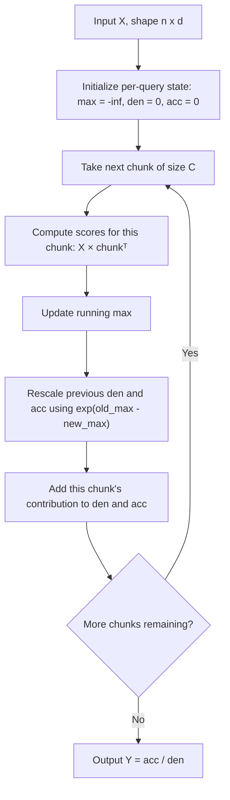
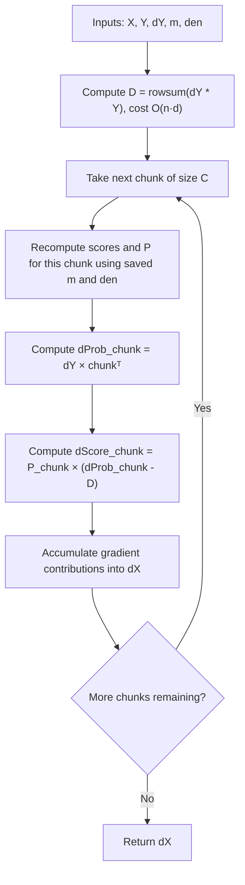

# Memory-Constrained Exact Attention

A from-scratch implementation of the forward and backward passes for self-attention that avoids materializing the full n x n score matrix. Peak memory is reduced from O(n^2) to O(n*d + n*C), where n is sequence length, d is the embedding dimension, and C is a fixed chunk size.

The implementation follows the chunked computation and online softmax approach described in Rabe and Staats (2021) and the recomputation strategy used in FlashAttention (Dao et al., 2022). This is a numpy implementation written to understand and verify the algorithm, not a GPU kernel.

## The problem

Standard self-attention computes, for each query i:

```
y_i = sum_j softmax_j(x_i . x_j^T) * x_j
```

Computing this directly requires forming the full score matrix S = X X^T, which has shape (n, n). For long sequences this dominates memory usage, scaling as O(n^2). The goal of this implementation is to compute the exact same output without ever forming S.

## Forward pass

### Chunked computation

Instead of computing all n scores for a query at once, keys and values are processed in chunks of size C. At any point, only one chunk of shape (C, d) needs to be held in memory, rather than the full (n, n) score matrix.

### Online softmax

Softmax normally requires all scores up front to compute the normalization denominator. Processing scores in chunks means the denominator has to be updated incrementally as each chunk arrives, without revisiting earlier chunks. This is done by tracking three running values per query: the running maximum score (for numerical stability), the running denominator, and the running weighted sum of values.

When a new chunk produces a higher maximum than seen so far, the previously accumulated denominator and weighted sum are rescaled by `exp(old_max - new_max)` before adding the new chunk's contribution. This rescaling keeps the final result mathematically identical to standard softmax attention, computed without ever holding more than one chunk in memory at a time.



After the forward pass, only X, Y, the running max (m), and the running denominator (den) are kept. The score matrix is never formed or stored.

## Backward pass

### Avoiding a second pass over P

Backpropagating through softmax normally requires the attention weight matrix P, where `P_ij = exp(s_ij) / Z_i`. Storing P costs O(n^2). The alternative is to recompute P chunk by chunk during the backward pass using the saved m and den values, which is what this implementation does.

Recomputing P naively would still require a correction term `D_i = sum_k P_ik * dP_ik`, which on its own would need a full pass over P before the main gradient loop, meaning P would be recomputed twice. This implementation avoids that by using the identity:

```
D_i = dY_i . Y_i
```

Since Y is already saved from the forward pass and dY is provided by the upstream gradient, D costs O(n*d) to compute and O(n) to store, with no extra pass over P. The backward pass then proceeds in a single chunk loop, recomputing P once per chunk and accumulating gradients into dX as it goes.



## Memory analysis

For n=128, d=32, C=16, with each float taking 4 bytes:

| | Peak memory | Asymptotic complexity |
|---|---|---|
| Standard attention (storing S and P) | approx. 96.0 KB | O(n^2) |
| Forward pass (this implementation) | 26.0 KB | O(n*d + n*C) |
| Backward pass (this implementation) | 56.5 KB | O(n*d + n*C) |

Since C is a fixed constant chosen at runtime, O(n*d + n*C) reduces to O(n*d), independent of n^2 terms.

## Compute cost

Both the standard and chunked approaches perform O(n^2 * d) floating point operations in total, since every (i, j) pair still needs to be visited. The chunked backward pass does not add a multiplicative compute overhead: recomputing P during the backward pass corresponds to one additional pass over the data, similar in cost to a second forward pass, not an extra factor of n.

## Possible extensions

- Numerical correctness check against a naive attention implementation (forward output and gradients).
- Extension to multi-head attention by applying the same per-head chunked computation.
- Batched inputs (currently written for a single sequence).
- A GPU implementation (e.g. using Triton) to additionally take advantage of the IO-awareness benefits described in the FlashAttention paper, which this numpy version does not capture since it does not model memory hierarchy or hardware-level data movement.

## References

1. Markus N. Rabe and Charles Staats. "Self-attention Does Not Need O(n^2) Memory." arXiv:2112.05682, 2021.
2. Tri Dao, Daniel Y. Fu, Stefano Ermon, Atri Rudra, Christopher Re. "FlashAttention: Fast and Memory-Efficient Exact Attention with IO-Awareness." NeurIPS 2022. arXiv:2205.14135.
